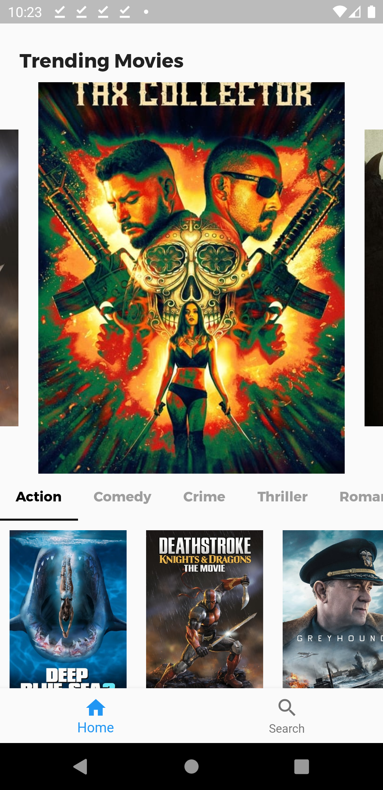
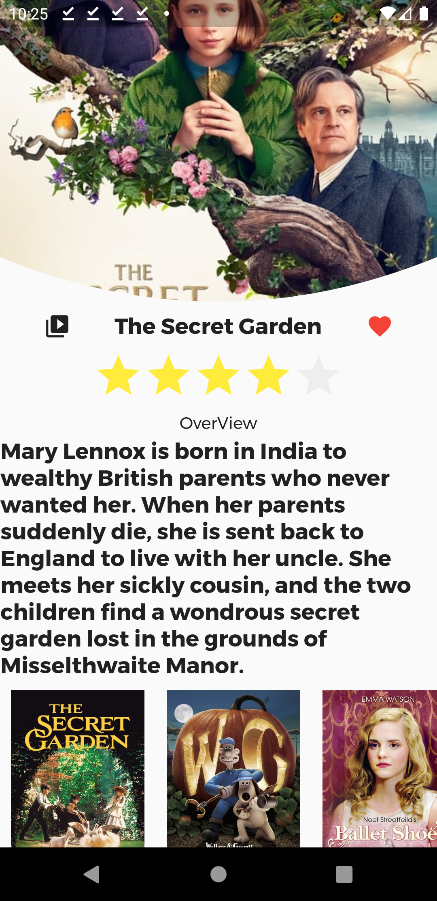

# Movie discovering App 

A full movie discovering app with flutter and tmdb api

# Youtube
* Full Youtube tutorial is available at my channel: https://youtu.be/i0y4NNPZXMs
## Features

* Users can discover a movie
* Neat UI with a auto carousel slider
* Users can also discover multiple categories , like action, romance,drama , comedy e.t.c
* Users can search for a movie
* Users can click on a movie for more details
* Users can see the review count or similiar movies
* Everything is realtime with streambuilder

## Screenshots
  
  
 
